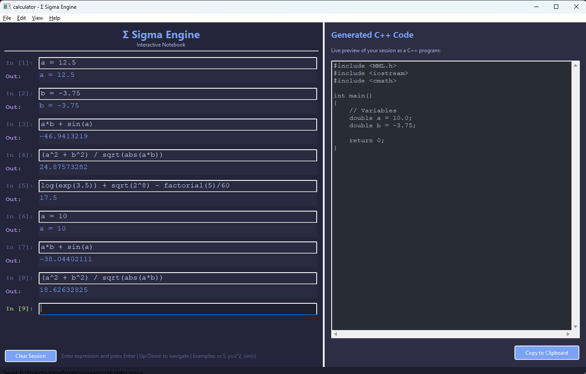
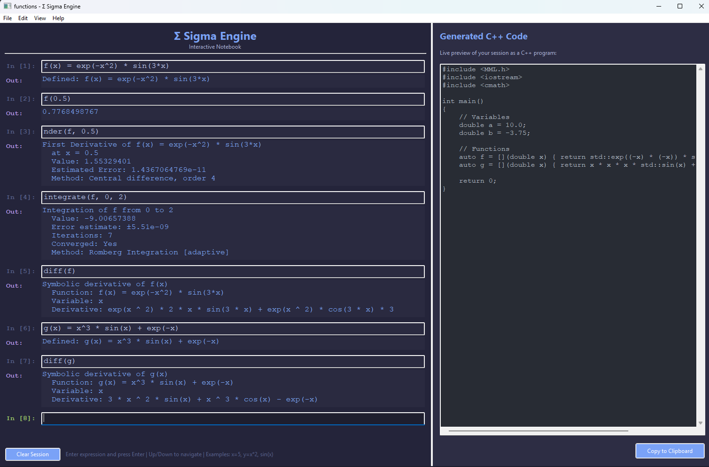
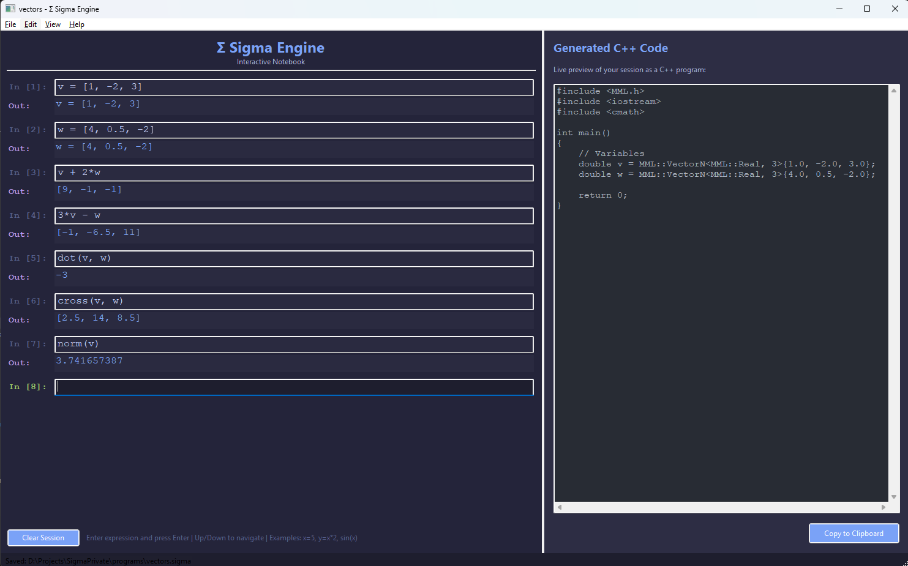
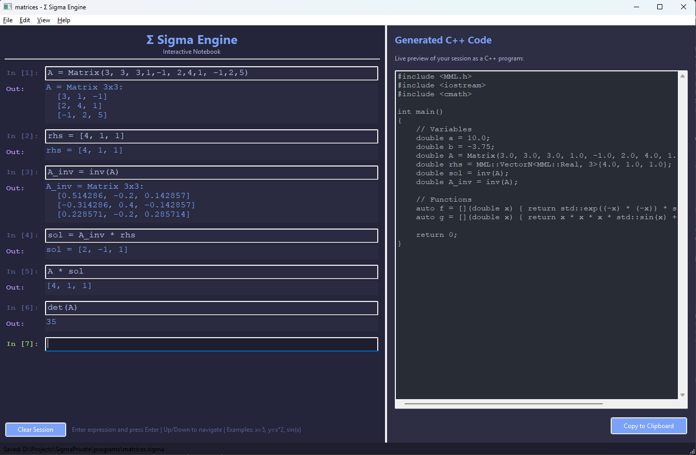

# SigmaEngine

SigmaEngine is a desktop mathematical notebook for interactive numerical work, symbolic differentiation, and C++ code generation.

It is built around the Minimal Math Library (MML): you type expressions, define functions, work with vectors and matrices, run numerical analysis operations, and keep a live generated C++ preview of the session.

The source project is developed privately. This public repository is the release home for downloadable installers, checksums, release notes, screenshots, and user-facing documentation.

## What You Can Do

- Use Sigma as a calculator with variables, constants, powers, elementary functions, and special functions.
- Define reusable mathematical functions and evaluate them numerically.
- Run numerical differentiation and integration directly from the notebook.
- Work with vectors: arithmetic, dot products, cross products, and norms.
- Work with matrices: determinants, traces, inverses, transposes, and matrix-vector products.
- Solve small linear systems interactively through matrix inversion and verify the result.
- Create polynomial objects and evaluate or differentiate them.
- Perform symbolic differentiation with `diff(f)`.
- Preview generated C++ code for the current session.

## Screenshots

### Calculator Workflow

Variables update during the session, and expressions are recomputed with the current values.



```text
a = 12.5
b = -3.75
a*b + sin(a)
(a^2 + b^2) / sqrt(abs(a*b))
log(exp(3.5)) + sqrt(2^8) - factorial(5)/60
a = 10
a*b + sin(a)
(a^2 + b^2) / sqrt(abs(a*b))
```

### Functions And Analysis

Define a function once, then evaluate it, differentiate it numerically, integrate it, and ask for a symbolic derivative.



```text
f(x) = exp(-x^2) * sin(3*x)
f(0.5)
nder(f, 0.5)
integrate(f, 0, 2)
diff(f)

g(x) = x^3 * sin(x) + exp(-x)
diff(g)
```

### Vectors

Sigma supports typed vector values and common vector operations.



```text
v = [1, -2, 3]
w = [4, 0.5, -2]

v + 2*w
3*v - w
dot(v, w)
cross(v, w)
norm(v)
```

### Matrices And Linear Systems

Matrix inversion and matrix-vector multiplication can be used to solve and verify a small linear system.



```text
A = Matrix(3, 3, 3,1,-1, 2,4,1, -1,2,5)
rhs = [4, 1, 1]
A_inv = inv(A)
sol = A_inv * rhs
A * sol
det(A)
```

## Download And Install

Download SigmaEngine from the GitHub Releases page:

<https://github.com/zvanjak/SigmaEngine/releases>

Release artifacts include installers or packages, `SHA256SUMS.txt`, and release notes with validation status and known platform caveats.

See [INSTALL.md](INSTALL.md) for installation and checksum verification instructions.

## Platform Status

See [SUPPORTED_PLATFORMS.md](SUPPORTED_PLATFORMS.md) for the current packaging matrix.

Recent release builds include desktop packages for macOS, Windows, and Ubuntu Linux. Platform availability is always determined by the artifacts attached to each GitHub release.

## Project Status

SigmaEngine is pre-1.0 software. User-facing behavior, file formats, generated code shape, and packaging details may change between early releases.

The 0.2 release line focuses on the notebook GUI, practical numerical workflows, typed vectors and matrices, symbolic differentiation, and a clearer public release experience.

## License

SigmaEngine release artifacts include the applicable license and third-party notices. Do not redistribute SigmaEngine outside the terms included with the published release artifacts.
